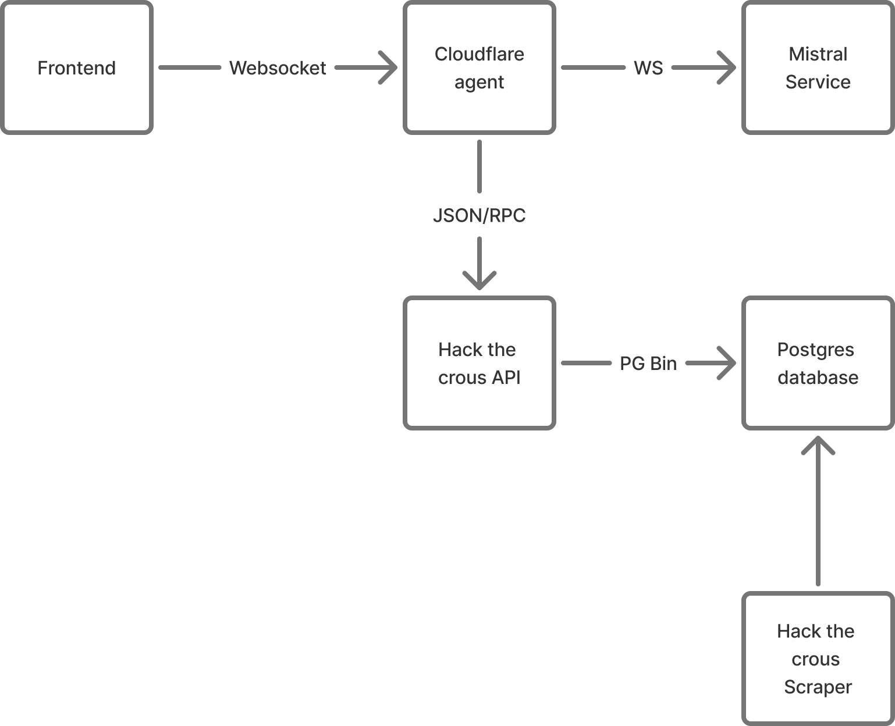

# HackTheCrous Agent

HackTheCrous agent is an AI agent powered by Cloudflare durable objects.
It interacts directly with the HackTheCrous api through an [MCP server](https://modelcontextprotocol.io).

Long story short, in 2020 I created a website called [hackthecrous.com](https://hackthecrous.com) that provides a search engine
to retrieve meals available in every cafeteria in Montpellier (the public cafeterias in France are managed by an organization called CROUS).
When I started this project, LLMs where not really an accessible service yet. But I always wanted to integrate natural language search in Hack The Crous.
I'm able to get restaurants menus by scraping the CROUS website. The scrapper then indexes itself the data and insert it in a Postgres Database.
I wanted to write my own naive "index engine" because I wanted to learn more about search engines. I'm currently thinking about replacing this
home-made algorithm by Elastic search or Quickwit.

Please visit the [Crousty page](https://hackthecrous.com/crousty) on Hack The Crous to test this feature. On your first connection, you will need to provide
a password to access the feature - here it is : `cl0udfl4re_plz_h1r3_m3`.

If too many people are using the LLM I might roll the password, so send an email to `radulescutristan@proton.me` if you don't manage to access the feature.

## Prompt suggestions

You might not have many prompt ideas, so here some of my go to prompts : 

- What are the open restaurants right now ?
- Which restaurant does have french fries in their menu ?
- What is the menu in Restaurant Boutonnet ?

## Architecture

I implemented an MCP server in ruby that provides the following tools:

- `fetch_restaurant_tool` : Basically a search engine for restaurants, based on a query the search engine returns the best restaurant. Search are indexed by meal content, restaurant name and restaurant closeness to schools.
- `fetch_menu_tool` : This tool returns a menu for a given restaurant.
- `get_restaurants` : This tool returns all restaurants.

Then, in this repository, I implemented a feedback loop so the agent can call these tools itself and retrieve the result of these tool calls.

Here are the source code for the different services displayed on that architecture diagram : 

- [Frontend](https://github.com/Courtcircuits/HackTheCrous.web) (written in React + Tailwind CSS)
- [Hack the crous API](https://github.com/Courtcircuits/HackTheCrous.api) (written in Ruby)
- [Hack the crous scraper](https://github.com/Courtcircuits/HackTheCrous.crawler) (written in Rust)

Most of the infrastructure, except the AI agent is hosted on a kubernetes cluster that I deployed on a VPS.
[Here is the helm charts that I wrote to deploy Hack The Crous](https://github.com/Courtcircuits/HackTheCrous.charts). 
[And here is the github repository that is used to deploy most of the cluster with ArgoCD](https://github.com/Courtcircuits/polytech-cluster/).

